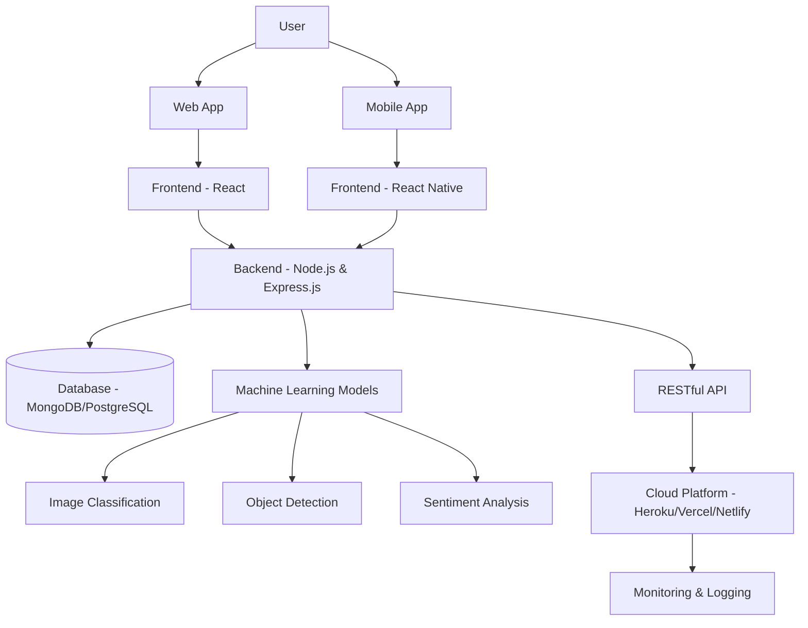
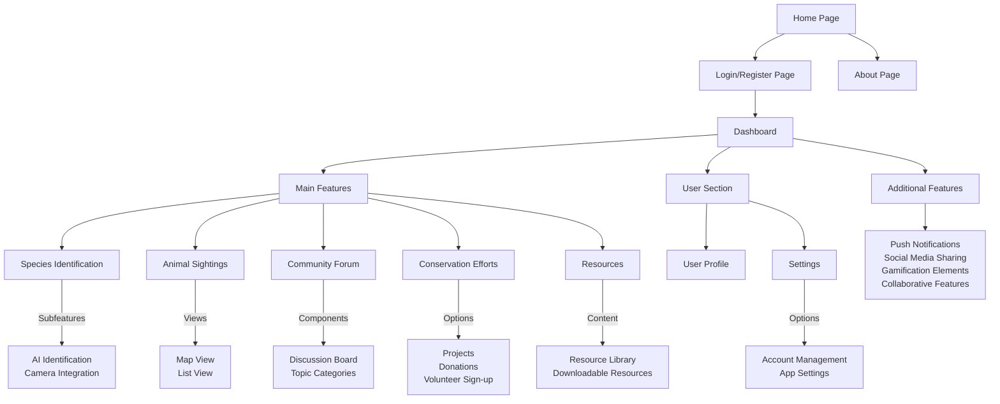

# Wildlife Conservation App

## Purpose

The Wildlife Conservation App is a comprehensive platform designed to engage users in wildlife conservation efforts through technology. Our app empowers nature enthusiasts, researchers, and conservationists by providing tools for species identification, tracking animal sightings, and fostering community engagement in conservation projects.

Key objectives:
- Facilitate easy and accurate identification of animal species using AI technology
- Create a centralized database of animal sightings to aid in conservation research
- Build a community of wildlife enthusiasts and promote knowledge sharing
- Raise awareness about ongoing conservation efforts and provide opportunities for involvement

## Tech Stack

### Frontend
- Web: React
- Mobile: React Native (using Expo)
- UI/UX Design: Figma, Adobe XD, or Sketch

### Backend
- Framework: Node.js with Express.js
- Database: MongoDB or PostgreSQL
- API: RESTful API

### Machine Learning
- Image Classification and Object Detection: TensorFlow or Core ML
- Sentiment Analysis: scikit-learn or Keras

### Deployment
- Cloud Platform: Heroku, Vercel, or Netlify (free tier)

### Testing
- Unit Testing: Jest or Pytest
- API Testing: Postman or Swagger

## Features

1. **Species Identification**
   - AI-powered image recognition for animal species
   - Camera integration for photo capture

2. **Animal Sightings Tracker**
   - Map view for geographical tracking
   - List view with detailed sighting information

3. **Community Forum**
   - Discussion boards
   - Categorized topics

4. **Conservation Projects**
   - Information on ongoing efforts
   - Donation and volunteer sign-up options

5. **Resource Library**
   - Articles, videos, and documents on wildlife conservation
   - Downloadable guides and reports

6. **User Profiles**
   - Customizable user accounts
   - Activity tracking and achievements

7. **Settings and Preferences**
   - Account management
   - App customization options

## Additional Features

- Push notifications for updates and reminders
- Social media integration for sharing
- Gamification elements (points, badges) for user engagement
- Collaborative features (discussion groups, shared sightings)

## Getting Started

(Include instructions for setting up the development environment, installing dependencies, and running the app locally)

## Contributing

(Provide guidelines for how others can contribute to the project)

## License

(Specify the license under which the project is released)

## Contact

(Provide contact information or links for users to reach out with questions or feedback)

# Project Diagram

# App Features

